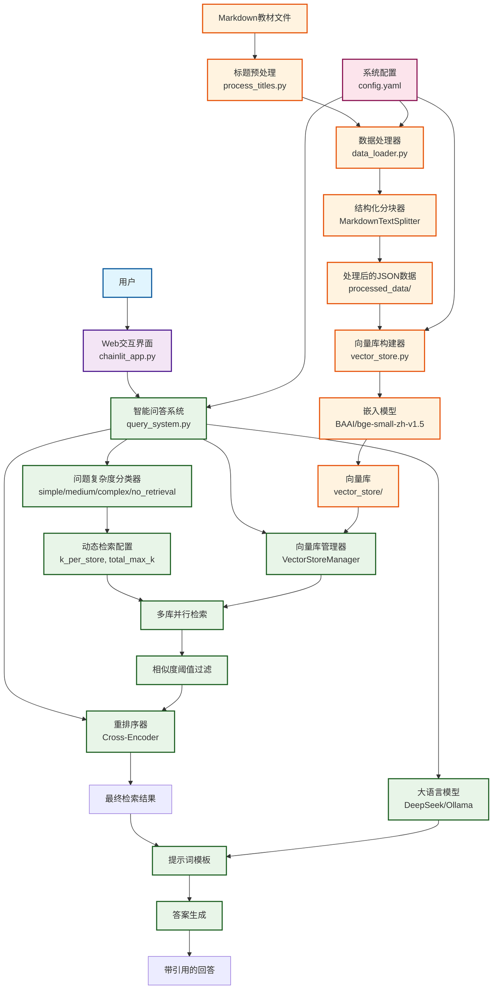

# ReTA

基于检索增强生成（RAG）的 AI 课程智能问答系统，使用 LangChain 框架和 Chainlit 界面。

*【项目分支】*
- `main`：无 Chainlit 历史记录功能，配置较易
- `master`：可使用 Chainlit 历史记录功能，需配置 PostgreSQL 数据库

## 一、项目定位

本项目旨在利用 RAG 技术，使大模型能够根据问题需求，智能检索知识库中的相关信息，减少幻觉，提供严格基于知识库的回答，并附精确的参考来源供进一步查阅。

## 二、功能特性

### 2.1 知识库构建

- 支持 Markdown 格式教材的结构化分块（保留标题层级、章节结构）
- 默认使用 BAAI/bge-small-zh-v1.5 嵌入模型构建向量库

### 2.2 向量检索

- 默认使用 BAAI/bge-small-zh-v1.5 嵌入模型将文本编码为向量
- 默认使用 BAAI/bge-reranker-base 交叉编码器，对检索结果进行重排序
- 支持根据配置启用动态检索参数（按问题复杂度自适应调整召回数量）

### 2.3 大模型集成

- 支持 DeepSeek 等在线 API 接入
- 支持本地 Ollama 部署

### 2.4 交互界面

- 基于 Chainlit 的 Web 对话界面
- 支持展示检索到的文档片段

### 2.5 回答规范

- 课程范围内问题：严格基于知识库，引用具体教材章节
- 超出范围问题：明确指出，并提供基于通用知识的回答

### 2.6 检索复杂度分类

- 引入检索复杂度分类器，将问题划分为 `simple` / `medium` / `complex` / `no_retrieval`
- 根据分类结果动态调整 `k_per_store` 与 `total_max_k`，兼顾检索效率与覆盖率
- 对 `no_retrieval` 类型问题可直接跳过向量检索，减少无效召回
- 支持通过 `qa_system.retrieval.dynamic_complexity` 配置分类比例与检索上限

### 2.7 待实现功能

- 文档上传：用户可在对话中上传文件作为上下文
- 查询增强：用户可选择是否优化输入内容，以尝试提升检索效果
- 网页界面优化：提供知识库选择等

## 三、快速开始

### 3.1 环境准备

- Python 3.11
- 创建 conda 虚拟环境:
```bash
# 使用 Conda 创建环境
conda create -n ReTA python=3.11.14 -y
conda activate ReTA

# 或使用 venv（Linux/macOS）
python -m venv ReTA
source ReTA/bin/activate  # Linux/macOS
# Windows: ReTA\Scripts\activate
```

#### 安装依赖
```bash
pip install -r requirements.txt
```

#### LLM 服务准备
- **在线 API**: 准备 DeepSeek 或其他兼容 OpenAI API 的密钥
- **本地模型**: 安装并运行 Ollama 服务（可选）

---

### 3.2 一键部署（推荐）

系统提供了一键部署工具，自动完成所有配置和初始化：

```bash
python deploy.py
```

---

### 3.3 手动配置

如需自定义配置或了解系统细节，可参考以下手动步骤：

#### 3.3.1 配置文件说明

编辑 `config.yaml` 文件进行系统配置：

```yaml
# LLM 配置（二选一）
qa_system:
  llm:
    # 选项 A：使用在线 API（如 DeepSeek）
    provider: "api"
    api_key: "sk-your-api-key-here"
    model_name: "deepseek-chat"
    
    # 选项 B：使用本地 Ollama 模型
    provider: "local"
    model_name: "qwen3:8b"

# 模型路径配置
  embedding:
    local_path: "D:/models/BAAI/bge-small-zh-v1.5"  # 本地嵌入模型
    online_fallback: "BAAI/bge-small-zh-v1.5"       # 在线备选模型
  
  rerank:
    cross_encoder_local_path: "D:/models/BAAI/bge-reranker-base"  # 本地重排序模型
```

**配置要点**：
- 路径使用正斜杠 `/` 或双反斜杠 `\\`
- 本地模型需提前从 [ModelScope](https://modelscope.cn) 下载

#### 3.3.2 手动运行步骤

**步骤 1：构建向量库**
```bash
# 使用预处理的文档数据
python vector_store.py --build --data ./processed_data --output ./vector_store

# 或处理新文档
python data_loader.py --input ./教材目录 --output ./processed_data
python vector_store.py --build --data ./processed_data --output ./vector_store
```

**步骤 2：启动 Web 界面**
```bash
# 开发模式（带热重载）
chainlit run chainlit_app.py -w

# 生产模式
chainlit run chainlit_app.py
```

访问 http://localhost:8000 开始使用。

#### 3.3.3 知识库扩展

**添加新教材**：
1. 将 Markdown 格式的教材文件放入 `资料库/` 目录
2. 确保标题格式规范（如 `# 1.1`、`## 1.1.1`）
3. 运行数据处理流程：

```bash
# 1. 标题规范化（可选）
python process_titles.py ./资料库

# 2. 文档分块处理
python data_loader.py --input ./资料库 --output ./processed_data

# 3. 增量更新向量库
python vector_store.py --update --data ./processed_data --output ./vector_store
```

**注意事项**：
- 教材文件名建议使用英文，防止构建 Chroma 向量库时报错
- 标题层级应清晰、无重复

## 系统架构



## 项目结构

```text
ReTA/
├─ README.md                     # 项目说明
├─ requirements.txt              # Python 依赖
├─ chainlit.md                   # Chainlit 应用说明
├─ chainlit_app.py               # Chainlit Web 交互入口
├─ query_system.py               # 问答系统核心（配置、检索、重排、复杂度分类、问答链）
├─ vector_store.py               # 向量库构建与管理（Chroma、批处理、连接池）
├─ data_loader.py                # Markdown 数据清洗与结构化分块
├─ check_environment.py          # 环境信息与依赖快照脚本
├─ config.yaml                   # 运行配置
├─ .gitignore                    # Git 忽略配置
├─ 资料库/                        # 教材数据目录
│  └─ process_titles.py          # 教材标题层级预处理脚本
├─ processed_data/               # 分块后的 JSON 数据（运行后生成）
└─ vector_store/                 # 持久化向量库目录（运行后生成）
```

## 后续计划

- 使用 LangGraph 实现更复杂的问答流程
