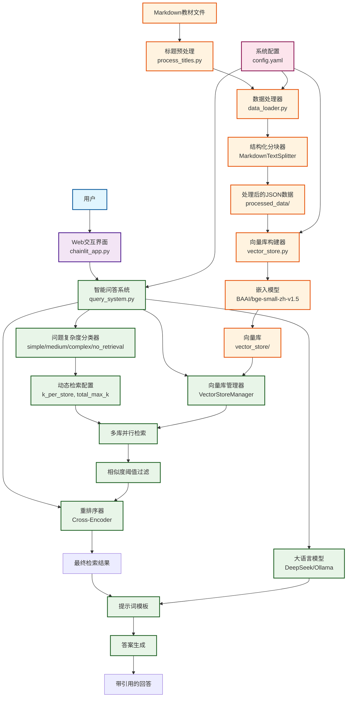

# ReTA

基于检索增强生成（RAG）的 AI 课程智能问答系统，使用 LangChain 框架和 Chainlit 界面。

*【项目分支】*
- `main`：无 Chainlit 历史记录功能，配置较易
- `master`：可使用 Chainlit 历史记录功能，需配置 PostgreSQL 数据库

## 一、项目定位

本项目旨在利用 RAG 技术，使大模型能够根据问题需求，智能检索知识库中的相关信息，减少幻觉，提供严格基于知识库的回答，并附精确的参考来源供进一步查阅。

## 二、功能特性

### 2.1 知识库构建

- 支持 Markdown 格式教材的结构化分块（保留标题层级、章节结构）
- 默认使用 BAAI/bge-small-zh-v1.5 嵌入模型构建向量库

### 2.2 向量检索

- 默认使用 BAAI/bge-small-zh-v1.5 嵌入模型将文本编码为向量
- 默认使用 BAAI/bge-reranker-base 交叉编码器，对检索结果进行重排序
- 支持根据配置启用动态检索参数（按问题复杂度自适应调整召回数量）

### 2.3 大模型集成

- 支持 DeepSeek 等在线 API 接入
- 支持本地 Ollama 部署

### 2.4 交互界面

- 基于 Chainlit 的 Web 对话界面
- 支持展示检索到的文档片段

### 2.5 回答规范

- 课程范围内问题：严格基于知识库，引用具体教材章节
- 超出范围问题：明确指出，并提供基于通用知识的回答

### 2.6 检索复杂度分类

- 引入检索复杂度分类器，将问题划分为 `simple` / `medium` / `complex` / `no_retrieval`
- 根据分类结果动态调整 `k_per_store` 与 `total_max_k`，兼顾检索效率与覆盖率
- 对 `no_retrieval` 类型问题可直接跳过向量检索，减少无效召回
- 支持通过 `qa_system.retrieval.dynamic_complexity` 配置分类比例与检索上限

### 2.7 待实现功能

- 文档上传：用户可在对话中上传文件作为上下文
- 查询增强：用户可选择是否优化输入内容，以尝试提升检索效果
- 网页界面优化：提供知识库选择等

## 三、快速开始

### 一键部署

```bash
python deploy.py
```

**部署流程**：
1. ✅ 检查 Python 版本（要求 3.11.x）
2. ✅ 安装 requirements.txt 中的所有依赖
3. ✅ 提供 API/Local 模型选择
4. ✅ 下载缺失的模型文件（嵌入模型和重排序模型）
5. ✅ 文本分块处理（处理教材文件）
6. ✅ 构建向量库
7. ✅ 启动 Chainlit 应用

### 3.1 环境准备

- Python 3.11
- 创建 conda 虚拟环境:
```bash
    conda create -n ReTA python=3.11.14 -y
    conda activate ReTA
```
- 安装依赖：`pip install -r requirements.txt`
- API 或 Ollama 本地服务

### 3.2 配置（于 `config.yaml` 中修改，注意路径使用正斜杠"`\`"）

1. API 密钥或 Ollama 本地模型
    - API：`qa_system.llm.api_key`、`api_base`、`model_name`、`provider`（默认 DeepSeek）
    - Ollama：`qa_system.llm.model_name`、`provider`
2. 模型路径（本地或在线，建议使用本地模型，在魔塔社区下载）
    - 重排序模型：`qa_system.rerank.cross_encoder_model`、`cross_encoder_local_path`
    - 嵌入模型：`qa_system.embedding.local_path`、`online_fallback`、`vector_processing.embedding.local_path`、`online_fallback`
3. 重排序方法（可选，默认使用交叉编码器）
    - `qa_system.rerank.method`

### 3.3 运行步骤

项目文件已包括分块后的 JSON 文件（`processed_data`）
1. 构建向量库：`python vector_store.py --process-all ./processed_data`
2. 打开 Chainlit 界面：`chainlit run chainlit_app.py -w`

### 3.4 添加新内容

默认教材文件标题清晰、无重复（如 `# 1.1`、`# 1.2.1`）
1. 将教材 Markdown 文件放入 `资料库` 目录
2. 标题处理：`python process_titles.py ./资料库`（直接覆盖原文件）
3. 数据分块：`python data_loader.py process "./资料库"`

## 系统架构



### 核心流程说明

1. **数据准备流程**: Markdown 教材文件 → 标题预处理 → 结构化分块 → 向量化存储
2. **问答处理流程**: 用户问题 → 复杂度分类 → 动态检索配置 → 多库并行检索 → 相似度过滤 → 重排序 → 答案生成
3. **配置管理**: 统一的 YAML 配置管理所有模块参数，支持灵活调整

## 项目结构

```text
ReTA/
├─ README.md                     # 项目说明
├─ requirements.txt              # Python 依赖
├─ chainlit.md                   # Chainlit 应用说明
├─ chainlit_app.py               # Chainlit Web 交互入口
├─ query_system.py               # 问答系统核心（配置、检索、重排、复杂度分类、问答链）
├─ vector_store.py               # 向量库构建与管理（Chroma、批处理、连接池）
├─ data_loader.py                # Markdown 数据清洗与结构化分块
├─ check_environment.py          # 环境信息与依赖快照脚本
├─ config.yaml                   # 运行配置
├─ .gitignore                    # Git 忽略配置
├─ 资料库/                        # 教材数据目录
│  └─ process_titles.py          # 教材标题层级预处理脚本
├─ processed_data/               # 分块后的 JSON 数据（运行后生成）
└─ vector_store/                 # 持久化向量库目录（运行后生成）
```

## 后续计划

- 使用 LangGraph 实现更复杂的问答流程
